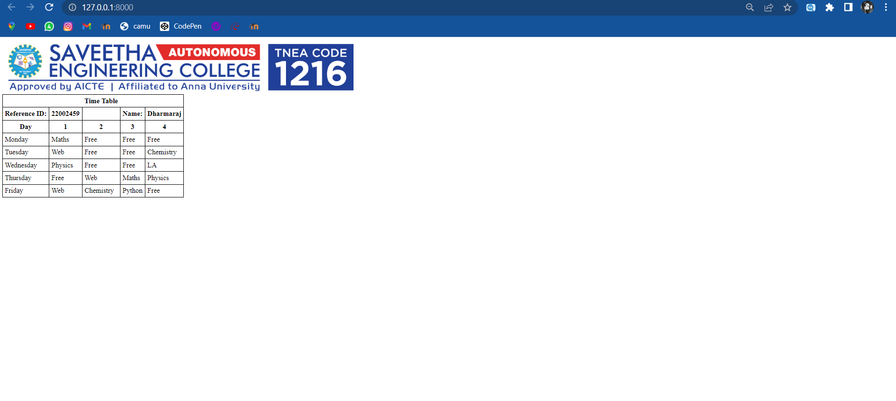

# Experiment_Time_Table

## AIM
To Write a html webpage page to display your timetable.

# ALGORITHM
### STEP 1
create a simple table using table tag
### STEP 2
Add header row using th tag
### STEP 3
Add your timetable
### STEP 4
Execute the program

# CODE
~~~


<html>
    <head>
        <title>SEC</title>
        <link rel="stylesheet" type="text/css" href="">
    </head>
    <body>
    
        
        
        <table>
            <tr id="tr">
                <th></th>
                <th></th>
                <th>Time Table</th>
                <th></th>
                <th></th>
            </tr>
            <tr>
                <th>Reference ID:</th>
                <th>22002459</th>
                <th></th>
                <th>Name:</th>
                <th>Dharmaraj</th>
            </tr>
            <tr>
                <th>Day</th>
                <th>1</th>
                <th>2</th>
                <th>3</th>
                <th>4</th>
            </tr>
            <tr>
                <td>Monday</td>
                <td>Maths</td>
                <td>Free</td>
                <td>Free</td>
                <td>Free</td>
            </tr>
            <tr>
                <td>Tuesday</td>
                <td>Web</td>
                <td>Free</td>
                <td>Free</td>
                <td>Chemistry</td>
            </tr>
            <tr>
                <td>Wednesday</td>
                <td>Physics</td>
                <td>Free</td>
                <td>Free</td>
                <td>LA</td>
            </tr>
            <tr>
                <td>Thursday</td>
                <td>Free</td>
                <td>Web</td>
                <td>Maths</td>
                <td>Physics</td>
            </tr>
            <tr>
                <td>Friday</td>
                <td>Web</td>
                <td>Chemistry</td>
                <td>Python</td>
                <td>Free</td>
            </tr>
        </table>
    
    </body>
</html>

~~~
# OUPUT

